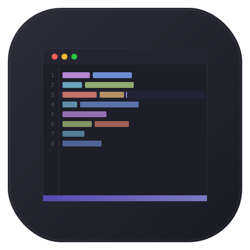

<p align="center">
  
</p>

<h1 align="center">NotepadMac</h1>

<p align="center">
  A fast, native macOS text editor inspired by Notepad++ — built entirely in Swift and AppKit.
</p>

<p align="center">
  <a href="https://github.com/freedom07/notepadmac/releases/latest">
    
  </a>
</p>

<p align="center">
  <a href="https://github.com/freedom07/notepadmac/actions/workflows/build.yml"></a>
  <a href="https://github.com/freedom07/notepadmac/releases/latest"></a>
  <a href="LICENSE"></a>
  
  
</p>

---

Switching from Windows to Mac and missing Notepad++? NotepadMac brings the familiar editing experience to macOS as a **true native app** — no Electron, no cross-platform compromises. Zero external dependencies, 100% Swift.

## Features

- **Piece Table engine** — efficient editing of large files with unlimited undo/redo
- **Syntax highlighting** for 19 languages (Swift, Python, JS/TS, HTML, CSS, Go, Rust, and more)
- **Multi-cursor editing** and column (block) selection
- **Code folding** — brace-based, indent-based, and region markers
- **Find & Replace** — regex, whole word, case sensitivity, Find in Files
- **16 built-in themes** — Monokai, One Dark, Dracula, Nord, Catppuccin, and more
- **Tabs** with drag-and-drop reordering and session restore
- **Command Palette** (Cmd+Shift+P) with fuzzy search
- **Macro system** — record, save, and replay editing macros
- **Markdown preview** with live rendering and dark mode support
- **Minimap** with viewport indicator
- **Split view** — horizontal and vertical editor splitting
- **Encoding support** — UTF-8, UTF-16, EUC-KR, Shift-JIS, GB2312, and more
- **File watching** — detects external file changes via FSEvents

## Installation

### Download DMG

Download the latest `.dmg` from the [Releases](https://github.com/freedom07/notepadmac/releases) page, open it, and drag **NotepadMac** to your **Applications** folder.

> **Note:** Since the app is not yet notarized, macOS will show an "unidentified developer" warning. Right-click the app and select **Open** to bypass this.

### Build from Source

Requires macOS 13+ and Swift 5.9+.

```bash
git clone https://github.com/freedom07/notepadmac.git
cd notepadmac

# Build and run
bash Scripts/build-app.sh
open .build/debug/NotepadMac.app

# Or build a release DMG
bash Scripts/create-dmg.sh
```

### Run Tests

```bash
swift test
```

## Architecture

NotepadMac is organized into 12 independent Swift modules with zero external dependencies:

```
Sources/
├── NotepadNext/          # App shell — AppDelegate, menus, command palette
├── NotepadNextCore/      # Core logic — macros, plugins, preferences, CLI
├── TextCore/             # Piece Table text engine, line indexing
├── EditorKit/            # Editor view, line numbers, minimap, split view
├── SyntaxKit/            # Syntax highlighting, 19 languages, code folding
├── ThemeKit/             # Theme system, 16 built-in themes
├── SearchKit/            # Find/Replace, Find in Files, regex
├── FileKit/              # File I/O, encoding detection, file watching
├── TabKit/               # Tab bar UI, tab management
├── MarkdownKit/          # Markdown → HTML renderer, WKWebView preview
├── PanelKit/             # Dockable panel framework
└── CommonKit/            # Shared utilities and extensions
```

## Contributing

Contributions are welcome! Feel free to:

1. **Report bugs** — [open an issue](https://github.com/freedom07/notepadmac/issues)
2. **Suggest features** — describe your use case in an issue
3. **Submit PRs** — fork, branch, and open a pull request

## License

[MIT](LICENSE) — free for personal and commercial use.
